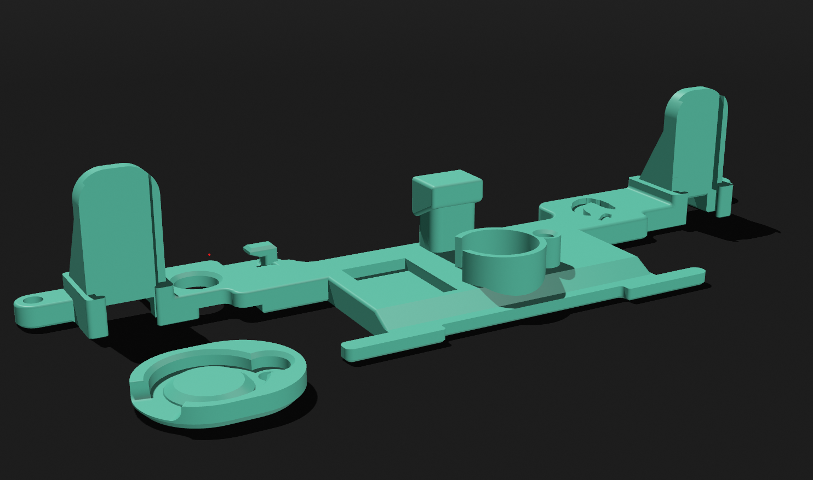
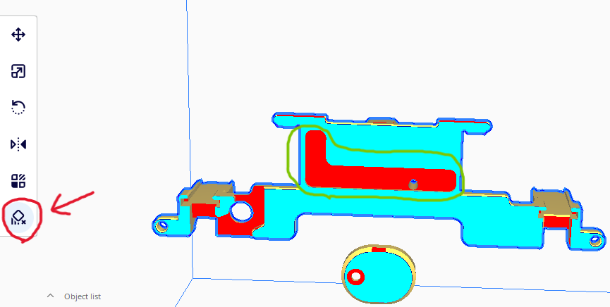
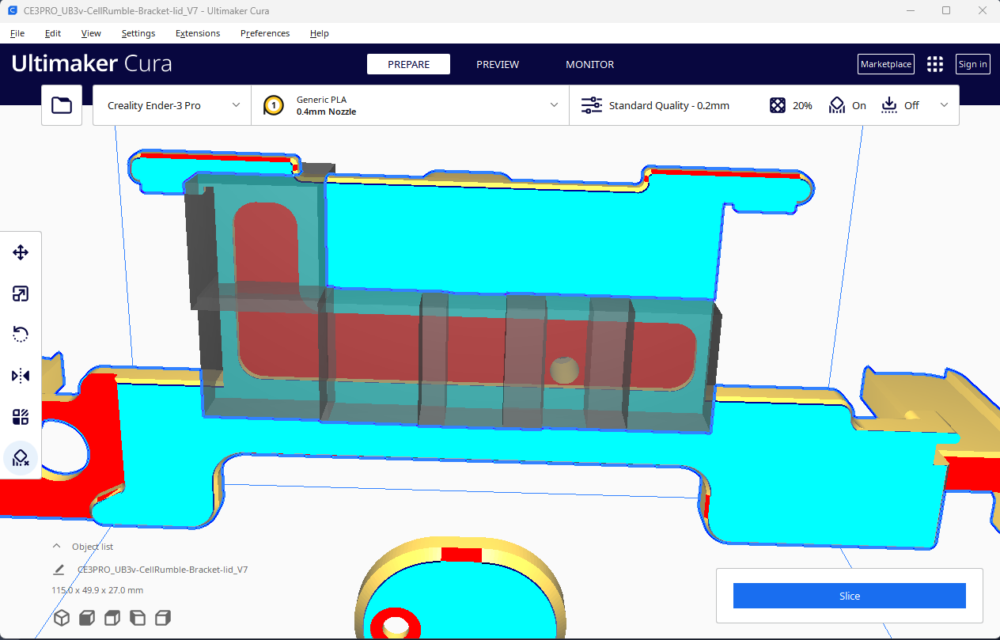
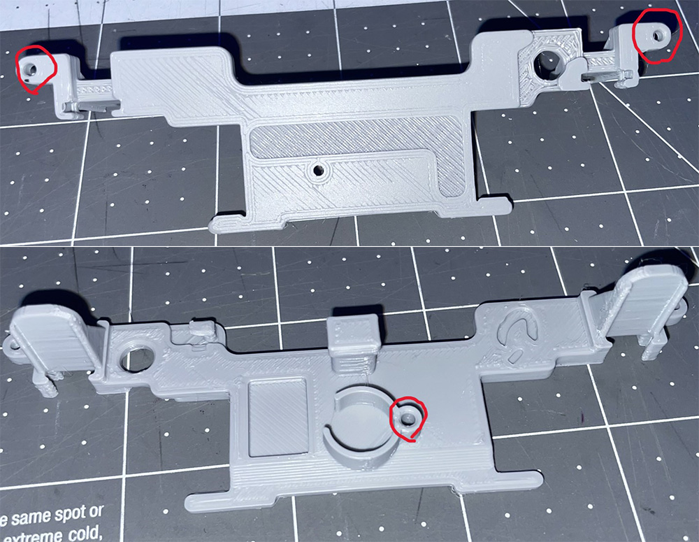
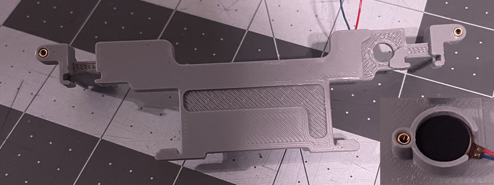

# **GCC-3v-Cellphone-Rumble**

3v Cellphone Rumble Bracket for the GCC and Phob GCC project.

## **An open source 3v "Cell-phone" Rumble Bracket for the PHOB & GCC with...**

-   compatible with either 3v Buck Converter or \~23 ohm resistor
-   Mouse click L/R compatibility
-   Cutout for OEM and snapback mod wires
-   L-cut hole for Phob 1.2.X teensy pins
-   Cell rumble mount with screw on lid
-   Open Source! Just throw me some credit on derivatives @abeartus :)
-   Shap3r editable files included!

## **required parts**

-   3-4x M1.6 Heat inserts [McMaster](https://www.mcmaster.com/92120A150/)

-   3-4x M1.6 Screw [McMaster](https://www.mcmaster.com/90910A901/)

-   1x 3v cellphone motor [Amazon](https://a.co/d/5VttFeg) [AliExpress](https://www.aliexpress.us/item/3256803801626556.html?spm=a2g0o.new_account_index.0.0.415d25b9mAlV31&gatewayAdapt=glo2usa&_randl_shipto=US)

*Pick one of the two methods for stepping down the controllers 5v out to the cell rumble's 3v*

**Resistor Method**

-   1x 25ohm resister [Amazon](https://a.co/d/4aCmpb3) (just need the 22ohm)

-   1x small 3:1 Heat shrink [Amazon](https://a.co/d/0B9l2j5)
 
**Buck Converter Bracket**

-   recommended : 1x 3v Buck converter not soldered [AliExpress](https://www.aliexpress.us/item/2251832865440609.html?spm=a2g0o.order_list.order_list_main.12.23001802KjRhRR&gatewayAdapt=glo2usa&_randl_shipto=US)
-   or
-   1x 3v Buck converter pre soldered [Amazon](https://a.co/d/hcY47oe) [AliExpress](https://www.aliexpress.us/item/3256802643066285.html?spm=a2g0o.detail.1000014.22.3128556atu7YrM&gps-id=pcDetailBottomMoreOtherSeller&scm=1007.40000.317745.0&scm_id=1007.40000.317745.0&scm-url=1007.40000.317745.0&pvid=9f4be090-9cd5-447a-85e5-b2ded161dbb8&_t=gps-id:pcDetailBottomMoreOtherSeller,scm-url:1007.40000.317745.0,pvid:9f4be090-9cd5-447a-85e5-b2ded161dbb8,tpp_buckets:668%232846%238110%23324&pdp_ext_f=%7B%22sku_id%22%3A%2212000030781473442%22%2C%22sceneId%22%3A%2230050%22%7D&pdp_npi=2%40dis%21USD%210.01%210.01%21%21%21%21%21%402101f6b716734767897904494edef0%2112000030781473442%21rec)

## **Guide**

### **1. Get a copy of the Bracket and Lid printed**

-   I usually print in PLA+, However regular pla, and rigid resins should work for the bracket

    {width=450 height=200}

-   If printing on your own home machine with Cura I recommend doing support blocking around the L-cut on the bottom for the Phob 1's Teensy pins.

    1.  Select the bracket in Cura

        {width=600 height=300}

    2.  Put the support blocking around the L-Cut channel

        {width=650 height=400}

### **2. Prep the cellphone motor**

**!!** *Use one of the two methods to step down the 5v to 3v* **!!**

#### **Resistor**

  1.  Cut the motor lead short

      {width=450 height=200}

  2.  splice in the \~23 ohm resistor

      {width=300 height=200}

  3.  Heat shrink over the connections/resistor

      {width=350 height=200}
 

#### **Buck Converter**

{width=450 height=200}

  1.  Cut the motor leads short, I recycle the remaining wire for the other two connections *(you will need to buy the longer wire motor for this though)*

      {width=400 height=400}

  2.  Solder the motor positive to the Buck Converter's **v**0 *(voltage out)*

  3.  Solder the motor negative, and another negative wire to the buck converter's **GND**

  4.  Solder a positive wire onto the Buck Converters **V**i *(Volatage in)*

      
      {width=360 height=400}
    

  5.  Try to keep the bottom of the buck converter as flush as possible if using the smaller variety

      
      {width=200 height=200}

### **3. Insert the motor into the bracket**

{width=350 height=200}

-   Extra step if using a buck converter

    1.  Glue the buck converter into the dugout to the right of the rumble housing. (I would recommend using some hot glue to hold it into place, super glue tends to ruin the buck converter for some reason when I use it)

### **4. Insert the Threaded Heat Inserts**

-   Using a soldering iron at around 200c or as low as possible with a small tip that can slot into the insert. push the three inserts into the Bracket.

-   The inserts should be pushed in on whatever side it will be screwed in from. So one pushed in from the top, and two on bottom. The proper side has a fillet around the slot that will make the insert easier to place at first.

    
    {width=500 height=400}
  

-   Personally I will set the insert into the brackets slot, then carefully push the insert in trying to be as perpendicular with the bracket as I can.

   
    {width=500 height=400}
   

-   the bottom ones can be tricky, I usually just flip the bracket over and put the slotted tab onto the table, then I use the method above.

    
    {width=400 height=300}

-   This Is what the threads should look like after insertion

   
    {width=700 height=300}

### **5. Attach the lid motor's lid to the Bracket**

1.  (semi-optional) I would recommend using some hot glue to help dampen any rattle from the lid and motor, and protect the short motor connection to the resistor.

    -   This is how I apply hot glue

    1.  *(only for my method of splicing in the resistor)* Put a small amount of glue here just to protect the wire from yanking and damaging the resistor splice and motor connection
    2.  *(optional)* Apply a light amount of hot glue here, then while the glue is hot press the rumble motor housing lid into place

    {width=450 height=400}

2.  Screw the lid into place with one of the three m1.6 screws

    {width=600 height=200}
    

### **6. Solder the Bracket onto the board**

... just like oem ...

### **7. Attach the Bracket onto the board**

I clip the top wings over the L\R sliders then pull the bottom over and onto the pcb

### **8. Screw the bracket into place with the remaining two screws**

Screw it :))

## **Credit**

-   similar guide by fires on [his bracket](https://firescc.com/mod-guides#/rumble-bracket), mine is similar, so credit to fires

