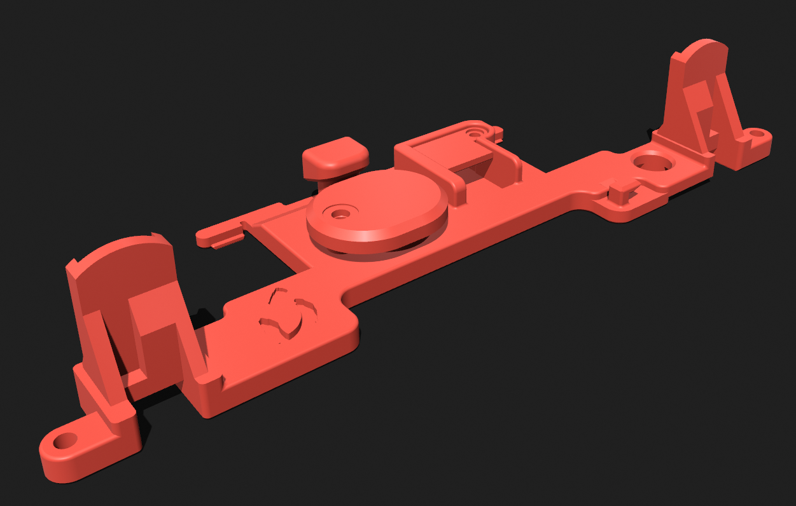
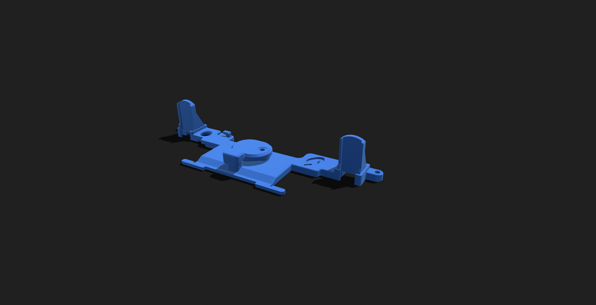

# GCC-3v-Cellphone-Rumble
3v Cellphone Rumble for the GCC and Phob GCC project.

### An open source Bracket for the Phob GCC with...
 - NEW design option for 3v Buck Converter
 - Mouse click L/R compatibility 
 - Cutout for OEM and snapback mod wires
 - L-cut hole for phob 1.2.X teensy pins
 - Cell rumble mount with screw on lid
 - Made for easy printing on FDM printers
 - Open Source! Just throw me some credit on derivatives @abeartus :)
 - Shap3r editable files included!
 
## Two Different Models

### Buck Converter Model
 
 
 
 - Uses a Buck convertor to step down the 5v to 3.3v
 - Bit more involved to construct
 - More consistent 3.3v 
 - Has a funny little light when it vibrates

### Classic Style Model
 
 
 
 - Needs a roughly 25 ohm resistor to step down the 5v to 3.3v 
 - Easier assembly
 
## required parts
 - M1.6 Heat inserts [McMaster](https://www.mcmaster.com/92120A150/)

 - M1.6 Screw [McMaster](https://www.mcmaster.com/90910A901/)
 
 - 3v cellphone motor [Amazon](https://a.co/d/5HEyPMW) [AliExpress](https://www.aliexpress.us/item/3256803801626556.html?spm=a2g0o.new_account_index.0.0.415d25b9mAlV31&gatewayAdapt=glo2usa&_randl_shipto=US)
 
 **for Classic Bracket**
 - 25ohm resister [Amazon](https://a.co/d/4aCmpb3) (just need the 22ohm)
 
 **for Buck Converter Bracket**
 - 3v Buck converter not soldered [AliExpress](https://www.aliexpress.us/item/2251832865440609.html?spm=a2g0o.order_list.order_list_main.12.23001802KjRhRR&gatewayAdapt=glo2usa&_randl_shipto=US)
 - 3v Buck converter pre soldered [Amazon](https://a.co/d/hcY47oe) [AliExpress](https://www.aliexpress.us/item/3256802643066285.html?spm=a2g0o.detail.1000014.22.3128556atu7YrM&gps-id=pcDetailBottomMoreOtherSeller&scm=1007.40000.317745.0&scm_id=1007.40000.317745.0&scm-url=1007.40000.317745.0&pvid=9f4be090-9cd5-447a-85e5-b2ded161dbb8&_t=gps-id:pcDetailBottomMoreOtherSeller,scm-url:1007.40000.317745.0,pvid:9f4be090-9cd5-447a-85e5-b2ded161dbb8,tpp_buckets:668%232846%238110%23324&pdp_ext_f=%7B%22sku_id%22%3A%2212000030781473442%22%2C%22sceneId%22%3A%2230050%22%7D&pdp_npi=2%40dis%21USD%210.01%210.01%21%21%21%21%21%402101f6b716734767897904494edef0%2112000030781473442%21rec)

## guide

 1. Get the bracket 
  - print the bracket and lid(s) ideally with PLA+ 
 *or*
  - order a set from JLCpcb (STL's in the JLCpcb STLs file)

 2. Heat insert the inserts :)
  - push in the heat inset screw inserts into the board with a soldering iron on the lowest temperature

 3. Stepping down the motor from 5v to 3v
  - **Classic Bracket**) attach a ~25 ohm (22ohm is suffiecient) resitor to the positive motor lead
 *OR*
  - **Buck module Bracket**) trim motor's wire leads then connect the buck converter to 3v and ground wires of the motor ( I save the extra wire for the rest of the connections)

 4. Final bracket assembly
   - put the motor (and Buck converter if you choose that model) in the housing and screw on the lid(s)

 5. Connecting to the controller PCB
  - **Classic Bracket**) attach the positive lead with the resiter, and ground line to the pcb's rumble out pads
 *OR*
  - **Buck Module Bracket**) connect the 5v and ground lines on the buck converter to the pcb's rumble out pads

 6. Final assembly
  - push in the trigger paddles, then put the bracket in place and screw it to the PCB. Done!

 
 + similar guide by fires on [his bracket](https://firescc.com/mod-guides#/rumble-bracket), mine is similar, so credit to fires 